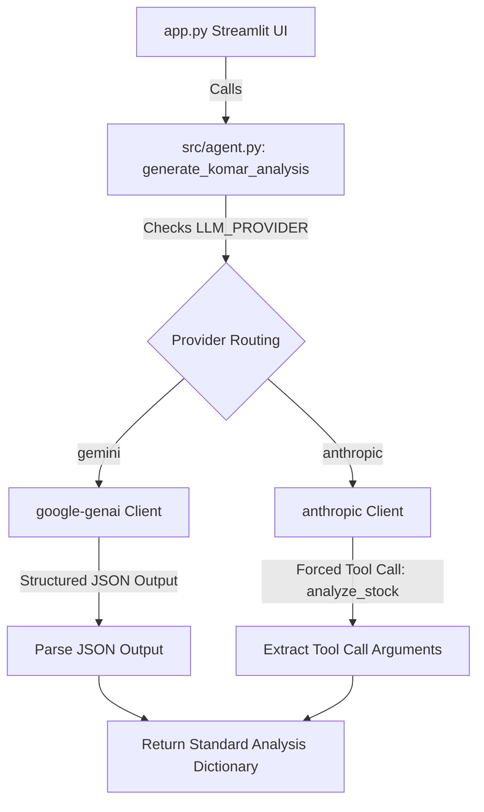

# Stock Analyst Multi-Provider (Anthropic Claude & Google Gemini) Design Specification

This design document specifies the architecture and patterns to integrate Anthropic Claude Sonnet 4.6 (including hybrid reasoning/thinking mode) into the Julian Komar Stock Analyst dashboard, while preserving the existing Google Gemini implementation as a selectable provider.

---

## 1. Architectural Overview

We will introduce a **Multi-Provider LLM Wrapper** in `src/agent.py`. The public interface `generate_komar_analysis` will remain identical to avoid breaking any consuming components in the Streamlit application or the automated tests.



---

## 2. Configuration & Environment Settings

The user manages the selection and options via `d:\Work\komar\.env`:

```ini
# LLM Provider Configuration
LLM_PROVIDER=anthropic                     # options: 'gemini' or 'anthropic'

# Google Gemini API Settings (Fallback/Optional)
GEMINI_API_KEY=AIzaSy...
GEMINI_MODEL=gemini-2.5-flash

# Anthropic Claude API Settings
ANTHROPIC_API_KEY=sk-ant-apixx...
ANTHROPIC_MODEL=claude-3-7-sonnet-20250219  # supports thinking
ANTHROPIC_THINKING_BUDGET=2048             # token budget for reasoning (set 0 to disable)
```

---

## 3. Component Details

### A. Dependency Configuration (`requirements.txt`)
Add the official Anthropic client package:
```txt
anthropic>=0.18.0
```

### B. LLM Agent Routing (`src/agent.py`)
1. **Conditionally initialize clients**: Create client instances using environment variables only when called.
2. **Pydantic to JSON Schema conversion**: Anthropic's tool API takes standard JSON schemas. We will convert `AnalysisResponse` dynamically:
   ```python
   tool_definition = {
       "name": "analyze_stock",
       "description": "Output structured qualitative research analysis applying Julian Komar's framework",
       "input_schema": AnalysisResponse.model_json_schema()
   }
   ```
3. **Anthropic Thinking Logic**:
   - Checking model name: Thinking is supported natively in `claude-3-7-sonnet-20250219` (referred as Claude Sonnet 4.6 in early-2026/hybrid thinking era).
   - If `ANTHROPIC_THINKING_BUDGET > 0` and the model name indicates thinking support, we configure the `thinking` dictionary:
     ```python
     thinking_params = {
         "type": "enabled",
         "budget_tokens": thinking_budget
     }
     max_tokens = thinking_budget + 4000  # ensures adequate headroom for actual response
     ```
   - If thinking is enabled, we pass `thinking` and `max_tokens` parameters to `client.messages.create`.
4. **Forced Tool Calling**:
   Pass `tools=[tool_definition]` and `tool_choice={"type": "tool", "name": "analyze_stock"}`. This forces the model to respond by populating the schema parameters, ensuring 100% adherence to our required JSON output keys.
5. **Robust Parsing**:
   Extract the `input` field from the forced tool call block inside `response.content`.

### C. Sidebar UI Indicators (`app.py`)
1. Read `LLM_PROVIDER` to adjust the Sidebar's status message dynamically.
2. If `LLM_PROVIDER == "anthropic"`, verify `ANTHROPIC_API_KEY` is present. Show a green key icon `🔑 Anthropic API Key configured.` or an error alert if missing.
3. If `LLM_PROVIDER == "gemini"`, keep existing Gemini key verification.

---

## 4. Verification & Testing Strategy

### Automated Verification
We will expand the unit tests in `tests/test_app.py` or create a new test file `tests/test_agent_providers.py` to:
1. Validate environmental configuration parsing.
2. Mock the `anthropic.Anthropic` client and simulate a forced tool call response.
3. Verify that the correct model, thinking parameters, and tool call payload are forwarded to Anthropic's API.
4. Verify fallback behaviors if thinking is disabled or credentials are missing.

### Manual Verification
1. Run `streamlit run app.py`.
2. Observe active provider status in the sidebar "Control Center".
3. Trigger stock searches (e.g. "Adani Power" or "Nvidia") using Claude and observe detailed qualitative output.
