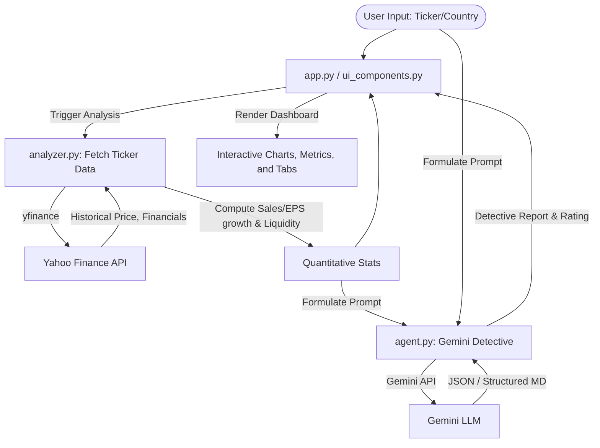

# Design Document: Julian Komar Stock Detective Dashboard

**Date**: 2026-05-26  
**Status**: Approved

## 1. Executive Summary
The goal of this application is to build a premium stock market analytics dashboard that applies seasoned trader Julian Komar's fundamental and thematic research framework to a given stock (US or India). The application leverages real-time stock data from `yfinance` to perform quantitative analyses (Sales/EPS growth and daily dollar volume liquidity) and combines it with the reasoning capabilities of Gemini (using the Google GenAI SDK) to carry out the qualitative "detective work" (analyzing business models, identifying catalysts, searching for sister stocks, checking theme alignment, and producing a final verdict).

---

## 2. Architecture & Directory Structure
The application follows a clean, multi-layered Python architecture:

```
d:\Work\komar\
├── .gitignore
├── requirements.txt            # Package dependencies
├── .env                        # Environment variables (GEMINI_API_KEY)
├── app.py                      # Main Streamlit dashboard entrypoint
├── docs/
│   └── plans/
│       ├── task.md             # Task checklist tracker
│       └── 2026-05-26-stock-analyst-design.md # This design doc
└── src/
    ├── __init__.py
    ├── analyzer.py             # Handles yfinance data fetching and quantitative metrics
    ├── agent.py                # Handles Gemini prompt formulation & LLM interactions
    └── ui_components.py        # Streamlit visual components & Plotly configurations
```

---

## 3. Data Flow & Component Specifications



### 3.1. Quantitative Data Fetcher (`analyzer.py`)
- **Ticker Parsing**: Resolves ticker names based on selected country (e.g. "Adani Power" -> fetches/suggests `ADANIPOWER.NS` or `ADANIPOWER.BO` for India; "NVDA" -> `NVDA` for US).
- **YoY Growth Calculations**:
  - Fetches the quarterly and annual revenue (Sales) and net income (EPS) from standard income statements.
  - Computes YoY percentage changes:
    $$\text{YoY Sales Growth} = \frac{\text{Sales}_{\text{current}} - \text{Sales}_{\text{prior}}}{\text{Sales}_{\text{prior}}} \times 100\%$$
- **Liquidity Check**:
  - Fetches historical daily prices (Close) and trading volume for the last 30 trading days.
  - Calculates Average Daily Dollar Volume:
    $$\text{Daily Dollar Volume} = \text{Close} \times \text{Volume}$$
    $$\text{Avg Daily Dollar Volume} = \text{mean}(\text{Daily Dollar Volume})_{30\text{ days}}$$
  - Checks if volume satisfies Komar's threshold:
    - Mature themes: $20M - $100M USD (or local currency equivalent).
    - Micro-caps / Emerging: $5M - $10M USD.

### 3.2. AI Detective Agent (`agent.py`)
- **System Role**: Expert fundamental and thematic analyst employing seasoned trader Julian Komar's rules.
- **Model**: `gemini-2.5-flash` or `gemini-1.5-flash`.
- **Inputs**: Stock name, country, and calculated quantitative metrics (Sales/EPS growth, average volume).
- **Tasks**:
  1. **Stock Categorization**: (CANSLIM Stock, Sales Grower, Story Stock).
  2. **The Story Layer (The "Why")**: Deep-dive business model and core catalysts (AI, clean energy, SaaS, robotics, etc.).
  3. **Sister Stocks & Theme Alignment**: Competitor tracking and broader theme validation.
  4. **Liquidity / Quality Assessment**: Analyzing if big institutions can accumulate the stock safely.
  5. **Verdict & Score**: Assigning a 1 to 5-star rating based strictly on Komar's framework.

### 3.3. UI / Visual Dashboard Component (`ui_components.py` & `app.py`)
- **Glassmorphic Cards**: Styled using custom Streamlit HTML/CSS injections to look sleek, dark, and glowing.
- **Plotly Stock Chart**: Sleek, glowing neon area/line chart representing stock price with overlay bar chart representing trading volume.
- **Sales & EPS Growth Visualization**: Visual growth indicators/bar charts comparing the numbers to the 20%, 30%, 40%+ thresholds.
- **Tabbed Interface**:
  - Tab 1: Financial Growth (YoY numbers & Stock Categorization).
  - Tab 2: The Detective Story (Business Model & Catalyst).
  - Tab 3: Competitors & Market Theme (Sister Stocks).
  - Tab 4: Verdict & Quality Checklist.

---

## 4. Error Handling & Edge Cases
- **Invalid Ticker Symbol**: If yfinance cannot find the ticker, the app will display a friendly error message, suggest correct suffixes (e.g. `.NS` for India), and prompt the user to try again.
- **Missing Financial Fields**: Some companies (especially young/growth stocks or foreign listings) may have missing quarterly data. The analyzer will gracefully handle `NaN` or `None` and display whatever historical numbers are available, while informing Gemini of any data gaps so it can extrapolate from web searches.
- **Missing Gemini API Key**: The app will check if `GEMINI_API_KEY` is present in the `.env` or system environment. If not, it will display a warning dialog and block execution until configured.

---

## 5. Verification & Testing
- **Local Testing**: Run Streamlit locally with `streamlit run app.py`.
- **Unit Testing**: Create minor test scripts inside a `tests/` or scratch directory to verify yfinance extraction for key tickers (e.g., `ADANIPOWER.NS` and `NVDA`) and verify Gemini prompt responses.
