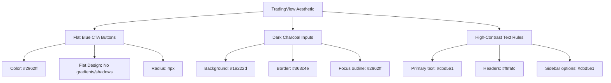

# Design Document: TradingView-Style Dashboard and High-Contrast Accessibility Overhauls

**Date**: 2026-05-26  
**Status**: Pending Review  

---

## 1. Goal Description
The purpose of this update is to overhaul the dashboard's user interface to look extremely premium, professional, and clean, mimicking the layout aesthetic of the **TradingView** application. Additionally, we will resolve all text readability issues where text blends into the dark background, ensuring 100% contrast compliance and beautiful, crisp readability across all screen regions.

---

## 2. Target Design Elements (TradingView Aesthetic)

### 2.1. Flat TradingView Buttons
- **Style Specification**:
  - Color: `#2962ff` (TradingView standard blue).
  - Hover: `#1e53e5` (subtle shade change).
  - Active: `#1a49c7`.
  - Border-radius: `4px` for a sharp, modern, semi-flat feel.
  - Border: `none`, Box-Shadow: `none`, Text-Shadow: `none` to completely strip out any standard browser or Streamlit gradients/decorations.
  - Button text inside the sidebar will be refined to `"Run Analysis"` to prevent awkward word-wrapping and look clean.

### 2.2. Dark Textboxes
- **Style Specification**:
  - Wrapper container `div[data-baseweb="input"]` background: `#1e222d`.
  - Border: `1px solid #363c4e`.
  - Border-radius: `4px`.
  - Input field background: `transparent` with text color `#ffffff` or `#cbd5e1`.
  - Focus state: border-color `#2962ff` with matching subtle blue outline glow.

### 2.3. High-Contrast Text Legibility (100% Contrast Compliance)
- **Problem**: Several text components (e.g. sidebar guidelines, radio input labels, paragraph text inside tabs) have extremely low contrast, rendering them nearly invisible.
- **Solution**:
  1. Target the markdown containers globally using `div[data-testid="stMarkdownContainer"]` to enforce `#cbd5e1` slate-text color as a base, ensuring all text inherits a readable, high-contrast hue.
  2. Overhaul sidebar radio button option selectors (`India`, `US`) to be explicitly styled in `#cbd5e1` to override any default black/dark-gray values.
  3. Remove all low-contrast hardcoded inline colors in `app.py` (e.g. `
`) and replace them with premium slate `#cbd5e1` colors.
  4. Ensure sidebar metadata lines, `hr` dividers, and status updates are visible but visually balanced.

---

## 3. Proposed Component Changes

### 3.1. [MODIFY] [ui_components.py](file:///d:/Work/komar/src/ui_components.py)
- Update CSS rules in `get_glassmorphic_css()`:
  - Add robust selectors for Streamlit text inputs wrapping: `div[data-testid="stTextInput"] div[data-baseweb="input"]`.
  - Refine `.stButton` overrides to catch `div[data-testid="stButton"] button` exactly.
  - Refine sidebar option selectors to force `div[data-testid="stRadio"] label` text to `#cbd5e1`.
  - Style `div[data-testid="stMarkdownContainer"]` directly so raw text blocks are fully legible.

### 3.2. [MODIFY] [app.py](file:///d:/Work/komar/app.py)
- Change sidebar CTA button label from `"Run Detective Analysis 🔍"` to `"Run Analysis"`.
- Replace all instances of `color: #64748b` in inline styles with `#cbd5e1` or `#94a3b8` for clear reading.
- Improve the Stock Categorization badge in `tab1` using the premium custom `.komar-badge` class.
- Adjust the welcome container instruction box layout and description contrast.

---

## 4. Verification Plan

### 4.1. Visual/Manual Verification
- Run: `streamlit run app.py` (already running).
- Inspect the visual layout:
  - Ensure the sidebar rules are perfectly readable.
  - Confirm the radio options "India" and "US" have high-contrast text.
  - Confirm the button is flat, vibrant blue (`#2962ff`), and does not warp or contain gradients.
  - Confirm the search text input has a dark background with thin border, matching TradingView.
  - Confirm tab research paragraphs are crisp and highly visible.

### 4.2. Automated Suite
- Run: `pytest -v` to ensure no changes broke unit tests.
