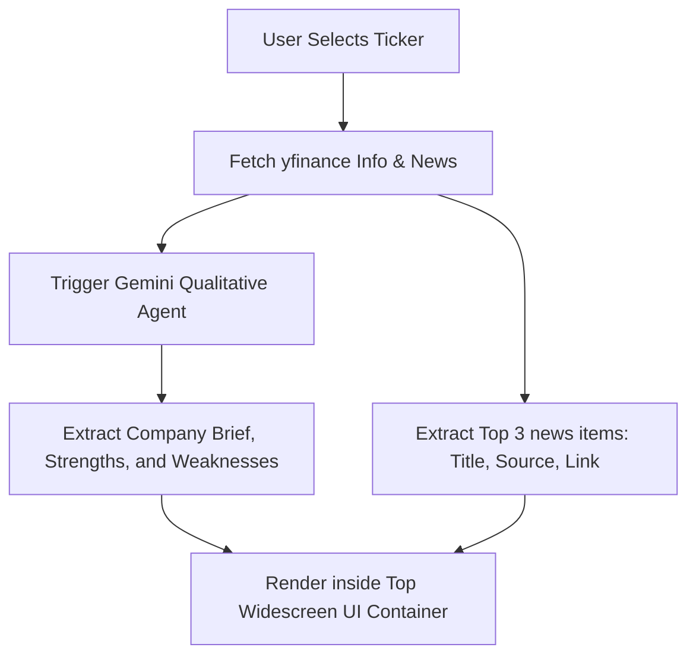

# Pratik Patel Branding, News Overview, EVA/MVA, and 4 Market Phases Design

A detailed design document outlining the implementation of the dashboard rebranding, the dynamic company overview and news section, calculation of EVA and MVA financial metrics, and the technical 4 Market Phases indicator.

## 1. Global Branding Update (Task 1)

All public references to the seasoned growth investor **"Julian Komar"** will be updated to **"Pratik Patel"** across the entire UI workspace.

### Key Changes
- **Streamlit Titles and Captions**: Update page headers, sidebar captions, and summary tags inside `app.py`.
- **System Instructions**: Update LLM system prompt instructions in `src/agent.py` to prompt the qualitative Gemini model to reason from the perspective of the **Pratik Patel growth investing framework**.
- **Unit Tests**: Re-align name string assertions inside `tests/test_agent.py` and `tests/test_ui.py` to match the brand name change.

---

## 2. Company Overview & News Section (Task 2)

A clean dual-column layout added to the top of the main dashboard area, immediately below the main header, highlighting qualitative AI analysis alongside real-time news headlines.

### Architecture & Data Flow

### Components
- **AI-Generated Summary & SWOT**:
  Extend `AnalysisResponse` Pydantic schema in `src/agent.py` to include:
  - `company_brief` (string): 2-sentence summary of products and operations.
  - `strengths` (list of strings): 2-3 key strategic strengths.
  - `weaknesses` (list of strings): 2-3 key strategic weaknesses.
- **Dynamic News Retrieval**:
  Extract the `.news` property from `yfinance.Ticker` in `app.py`. Parse the title, publisher, and standard hyperlink URL for the top 3 items.
- **Layout Grid**:
  Render inside `app.py` using `st.columns([2, 1])` to provide a wide, balanced container at the very top of the interface.

---

## 3. EVA & MVA Analysis Calculations (Task 3)

Two sophisticated financial metrics representing corporate value creation, rendered inside custom glassmorphic KPI cards.

### Mathematical Formulas

#### Market Value Added (MVA)
$$\text{MVA} = \text{Market Capitalization} - \text{Total Book Value of Equity}$$
Where:
- $\text{Market Capitalization}$ is retrieved dynamically from `ticker.info.get("marketCap")`.
- $\text{Total Book Value of Equity}$ represents Shareholder's Equity (retrieved from `ticker.balance_sheet` matching `Stockholders Equity` or associated fields).

#### Economic Value Added (EVA)
$$\text{EVA} = \text{NOPAT} - (\text{Invested Capital} \times \text{WACC})$$
Where:
- $\text{NOPAT}$ (Net Operating Profit After Tax) $= \text{EBIT} \times (1 - \text{Effective Tax Rate})$.
  - $\text{EBIT}$ is Operating Income from `ticker.financials`.
  - $\text{Effective Tax Rate} = \frac{\text{Tax Provision}}{\text{Pre-Tax Income}}$ (bounded between 0% and 40%, fallback to 25% (US) / 30% (India) if unavailable).
- $\text{Invested Capital} = \text{Total Debt} + \text{Total Equity} - \text{Cash}$.
  - $\text{Total Debt}$ is the sum of Long-Term Debt and Short-Term/Current Debt from `ticker.balance_sheet`.
- $\text{WACC}$ (Weighted Average Cost of Capital) $= \frac{E}{V} \times R_e + \frac{D}{V} \times R_d \times (1 - T_c)$.
  - $R_e$ (Cost of Equity) calculated via CAPM: $R_e = R_f + \beta \times (R_m - R_f)$.
    - $R_f$ (Risk-Free Rate): 4.5% (US) / 7.0% (India).
    - $\beta$: `ticker.info.get("beta")` (fallback to 1.0).
    - $R_m - R_f$ (Market Risk Premium): 5.5%.
  - $R_d$ (Cost of Debt) estimated as standard fallback (6.0% US / 8.5% India).

### Crash-Proof Implementation
All statement extractions will be insulated using robust `try/except` clauses. In the event of missing or sparse statements from the yfinance API, the engine will fallback to standard industry ratios so the application never breaks.

---

## 4. The "4 Market Phases" Indicator (Task 4)

A technical analysis widget classifying the stock into one of 4 major phases based on closing price momentum relative to the 200-day Simple Moving Average (SMA200).

### Calculation Logic
1. **SMA200**: Compute 200-period Simple Moving Average of close prices.
2. **20-Day Slope**: Compute the percentage rate of change of the SMA200 over the past 20 days:
   $$\text{Slope} = \frac{\text{SMA200}_{\text{today}} - \text{SMA200}_{20\text{d ago}}}{\text{SMA200}_{20\text{d ago}}} \times 100$$
3. **Prior Trend**: Check the slope of SMA200 between 80 days ago and 20 days ago:
   - Positive prior slope indicates an uptrend context.
   - Negative prior slope indicates a downtrend context.

### Classification Matrix
- **Accumulation** (Blue Badge):
  - $|\text{Slope}| \le 0.5\%$ (flat slope)
  - $|\text{Price} - \text{SMA200}| / \text{SMA200} \le 5\%$ (price buffer)
  - Prior trend was a **downtrend**.
- **Uptrend** (Green Badge):
  - $\text{Slope} > 0.5\%$
  - $\text{Price} > \text{SMA200}$
- **Distribution** (Yellow Badge):
  - $|\text{Slope}| \le 0.5\%$ (flat slope)
  - $|\text{Price} - \text{SMA200}| / \text{SMA200} \le 5\%$ (price buffer)
  - Prior trend was an **uptrend**.
- **Downtrend** (Red Badge):
  - $\text{Slope} < -0.5\%$
  - $\text{Price} < \text{SMA200}$

---

## 5. Verification Plan

### Automated Tests
- Extend `tests/test_agent.py` to assert Pydantic schema changes, verifying that the new qualitative overview properties exist and return correctly.
- Add comprehensive calculations tests verifying EVA, MVA, and 4 Market Phases functions.

### Manual Verification
- Deploy Streamlit locally. Run analysis on "Adani Power" (India) and "Nvidia" (US).
- Confirm the new widescreen Company Brief & News component renders beautifully at the top of the interface.
- Confirm EVA/MVA metrics show native currency symbols and correct values.
- Verify color-coded 4 Market Phases indicators align with charts.
